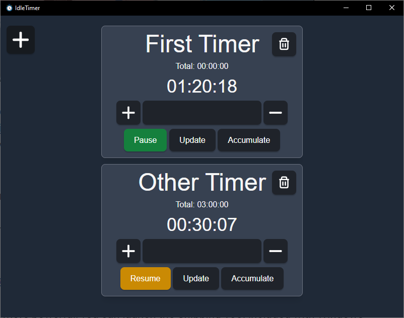
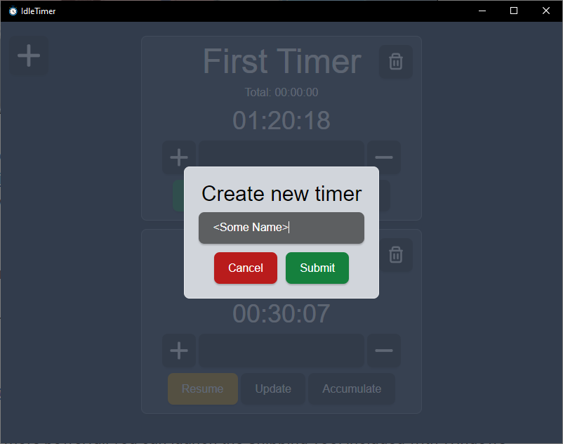

# Idle Timer
Idle Timer is a timer that lets you measure time. Contrary to other timers though, Idle Timer doesn't use the CPU while it's running. It does so by storing a timestamp when you start a timer and computing the time delta between the point in time when you stop the timer and the initially stored timestamp.

## Screenshots



## Features
- Multiple timers
- No CPU utilization while a timer or multiple timers are running
- You can manually change the time by adding or subtracting time:
  - Type the time you want to add/subtract into the input field of the timer
  - The format is ahbmcs for changing the time by a hours b minutes and c seconds, an example would be 1h30m20s. You can also omit parts (like seconds) if you don't want to change them
  - Click on the plus if you want to add the timer and on the minus to subtract the time
- You can accumulate the current time to the total time of the timer
- All timers are stored in a file. This file is updated whenever a timer changes. Thus changes persist even after closing the program
- Press space the resume or pause the timer that currently has focus

## Tech Stack
The app is written using [Tauri](https://tauri.app/), a tool for building cross platform apps using web technology. For the web components, svelte with typescript is used. The styling is done via tailwind.

## Building
Building the project is relatively easy. There are multiple was of building, in the following the build procedure using npm is explained. However you can also build with other package managers.

First clone the source code

```sh
git clone https://github.com/MissSis/IdleTimer.git
```
and install all dependencies

```sh
npm i
```

After completion run the build command:
```sh
npm run tauri build
```
On Windows, this will place an installer in `src-tauri/target/release/build/msi`.

For more information about building tauri apps see the [official documentation](https://tauri.app/v1/guides/building/). There you can find out how to use other package managers for building, as well as what is build for other platforms like Linux and MacOS.

## Setup
There is one thing you need to do to set up IdleTimer: Create a directory where the file that contains all the timer information can be stored. When you start IdleTimer and the directory doesn't exist there will be an error message which displays the path where IdleTimer wants to create the file. So make sure all the directories in the path exist (you don't need to create the file, this will be done automatically).

## Copyright
The icons inside the program are from https://www.svgrepo.com/.

The app icon is from https://www.flaticon.com/